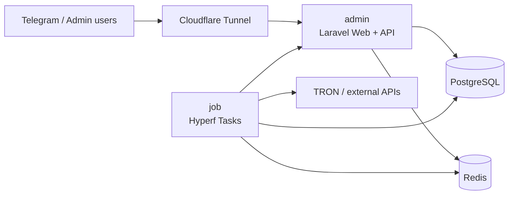

# TGBot Ultra v1

<p align="center">
  
  
  
  
</p>

<p align="center">
  <b>TGBot Ultra v1 production deployment kit.</b><br>
  Pulls prebuilt GHCR images and keeps runtime secrets outside Git.
</p>

---

## Overview

This repository is the **production deployment repository** for `TGBot Ultra v1`.

It does not contain application source code. The runtime services are started from remote container images:

| Service | Image | Role |
|---|---|---|
| `admin` | `ghcr.io/cnmbdb/tgbot-admin:latest` | Laravel admin panel, API entry, Telegram webhook receiver |
| `job` | `ghcr.io/cnmbdb/tgbot-job:latest` | Hyperf/Swoole task runner, cron jobs, queue and blockchain monitors |
| `postgres` | `postgres:15-alpine` | Main PostgreSQL database |
| `redis` | `redis:7-alpine` | Cache, queue and runtime state |
| `tunnel` | `cloudflare/cloudflared:latest` | Cloudflare Tunnel ingress |

> [!IMPORTANT]
> Keep `.env` private. This repository only tracks `.env.example`.

## Repository Files

```text
.
├── docker-compose.yml     # Production service orchestration
├── DB_PostgreSQL.sql      # First-run PostgreSQL initialization schema
├── .env.example           # Public environment variable template
├── .gitignore             # Keeps .env and local runtime files out of Git
└── README.md              # This deployment guide
```

## Architecture



## Quick Start

### 1. Prepare the Server

Required:

| Tool | Version |
|---|---|
| Docker Engine | 20.10+ |
| Docker Compose plugin | 2.x |
| Git | Any modern version |

```bash
git clone https://github.com/cnmbdb/tgbot-Ultra-v1.git
cd tgbot-Ultra-v1
```

### 2. Create `.env`

```bash
cp .env.example .env
nano .env
```

Minimum production values to review:

| Variable | Purpose |
|---|---|
| `APP_ENV` | Use `production` for production |
| `APP_DEBUG` | Use `false` in production |
| `APP_KEY` | Laravel application key |
| `APP_URL` | Public admin URL |
| `DB_DATABASE` | PostgreSQL database name |
| `DB_USERNAME` | PostgreSQL username |
| `DB_PASSWORD` | PostgreSQL password |
| `REDIS_HOST` | Usually `redis` inside Compose |
| `REDIS_PORT` | Usually `6379` |
| `API_WEB_URL` | External API service URL |
| `WEB_URL` | Service callback/base URL used by jobs |
| `TRONSCAN_API_KEYS` | Tronscan API keys, comma separated |
| `TRONGRID_API_KEYS` | Trongrid API keys, comma separated |
| `TUNNEL_TOKEN` | Cloudflare Tunnel token |

> [!TIP]
> For multiline or sensitive values, keep them in `.env` only. Do not paste real secrets into issues, commits, screenshots or README examples.

### 3. Start Services

```bash
docker compose pull
docker compose up -d
docker compose ps
```

### 4. Watch Logs

```bash
docker compose logs -f admin
docker compose logs -f job
docker compose logs -f postgres
docker compose logs -f tunnel
```

## Runtime Volumes

| Volume | Mounted To | Purpose |
|---|---|---|
| `postgres_data` | `/var/lib/postgresql/data` | Persistent database storage |
| `redis_data` | `/data` | Redis append-only persistence |
| `admin_storage` | `/var/www/html/storage` | Laravel storage and uploads |
| `admin_cache` | `/var/www/html/bootstrap/cache` | Laravel bootstrap cache |
| `job_storage` | `/opt/www/runtime` | Hyperf runtime files |

The database schema in `DB_PostgreSQL.sql` is mounted into PostgreSQL as:

```text
/docker-entrypoint-initdb.d/001_DB_PostgreSQL.sql
```

It is applied only during the first initialization of an empty `postgres_data` volume.

## Common Operations

### Deploy or Update Images

```bash
docker compose pull
docker compose up -d
docker image prune -f
```

### Restart One Service

```bash
docker compose restart admin
docker compose restart job
```

### Stop Services

```bash
docker compose down
```

### Reset Database

> [!CAUTION]
> This deletes the PostgreSQL volume and re-runs the initialization SQL. Back up production data before running it.

```bash
docker compose down -v
docker compose up -d
```

## Backup

Create a database backup:

```bash
docker compose exec postgres sh -c 'pg_dump \
  -U "$POSTGRES_USER" \
  -d "$POSTGRES_DB"' \
  > backup_$(date +%Y%m%d_%H%M%S).sql
```

Restore a backup:

```bash
cat backup.sql | docker compose exec -T postgres sh -c 'psql \
  -U "$POSTGRES_USER" \
  -d "$POSTGRES_DB"'
```

## Health Checks

| Service | Check |
|---|---|
| `admin` | `curl -sf http://127.0.0.1/` inside the container |
| `job` | `wget -qO- http://127.0.0.1:9501` inside the container |
| `postgres` | `pg_isready` with configured database credentials |
| `redis` | `redis-cli ping` |

Useful command:

```bash
docker compose ps
```

## Troubleshooting

<details>
<summary><b>Containers keep restarting</b></summary>

Check the failing service logs first:

```bash
docker compose logs --tail=200 admin
docker compose logs --tail=200 job
docker compose logs --tail=200 postgres
```

Common causes are missing `.env` values, invalid database credentials, unreachable external APIs or a bad Cloudflare Tunnel token.
</details>

<details>
<summary><b>Database tables are missing</b></summary>

`DB_PostgreSQL.sql` only runs when the PostgreSQL data volume is empty. If `postgres_data` already exists, PostgreSQL will not re-run initialization scripts.

For a fresh deployment:

```bash
docker compose down -v
docker compose up -d
```

For production data, prefer a controlled migration or manual SQL import after backing up data.
</details>

<details>
<summary><b>Telegram webhook does not respond</b></summary>

Make sure your public route points to the `admin` service. The `job` service runs background tasks and does not replace the admin webhook endpoint.

Also confirm:

```bash
docker compose logs --tail=200 tunnel
docker compose logs --tail=200 admin
```
</details>

## Security Notes

- `.env` is ignored by Git and must stay private.
- Rotate credentials if they were ever committed or shared.
- Use strong database passwords in production.
- Keep server firewall rules narrow; expose only the intended public entrypoint.
- Prefer fixed image tags for strict release control when operating multiple servers.

## Production Checklist

- [ ] `.env` created from `.env.example`
- [ ] `APP_DEBUG=false`
- [ ] Strong `DB_PASSWORD`
- [ ] Valid `TUNNEL_TOKEN`
- [ ] External API URLs verified
- [ ] `docker compose config` passes
- [ ] `docker compose ps` shows healthy services
- [ ] Database backup plan confirmed

---

<p align="center">
  Built for quiet, repeatable production deployment.
</p>
